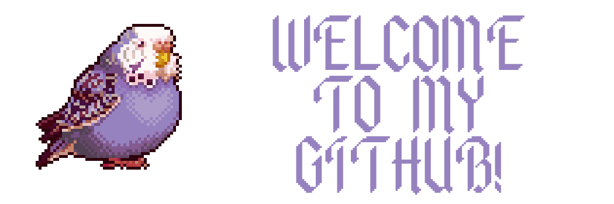

  

<h1 align="center">Hi 👋, I'm Efe Danniels!</h1>
<h3 align="center"> Hello there, I'm Efe Daniels, a junior web3 developer with a passion for creating decentralized applications (dApps) using blockchain technology. I have experience with front-end development using React and Angular, as well as back-end development with Solidity and IPFS. I'm always eager to learn and keep up with the latest advancements in the web3 space, as well as collaborate with other developers to build innovative solutions. When I'm not coding, you can find me reading up on the latest crypto news or playing around with new tools and frameworks. Let's build the decentralized future together!</h3>

- 🔭 I’m currently working on **Blockchain Technologies.**

- 🌱 I’m currently learning **Solidity, Ethers, Go-Ethereum, Flashbots.**

- 💬 You can ask me about **DeFi, NFTS, DApps and more** or you can send me some hugs from telegram! (Telegram: https://t.me/efe_G_35 )

  

<h3 align="left">Languages and Tools:</h3>

<a href="https://www.gnu.org/software/bash/" target="_blank"> 

  

